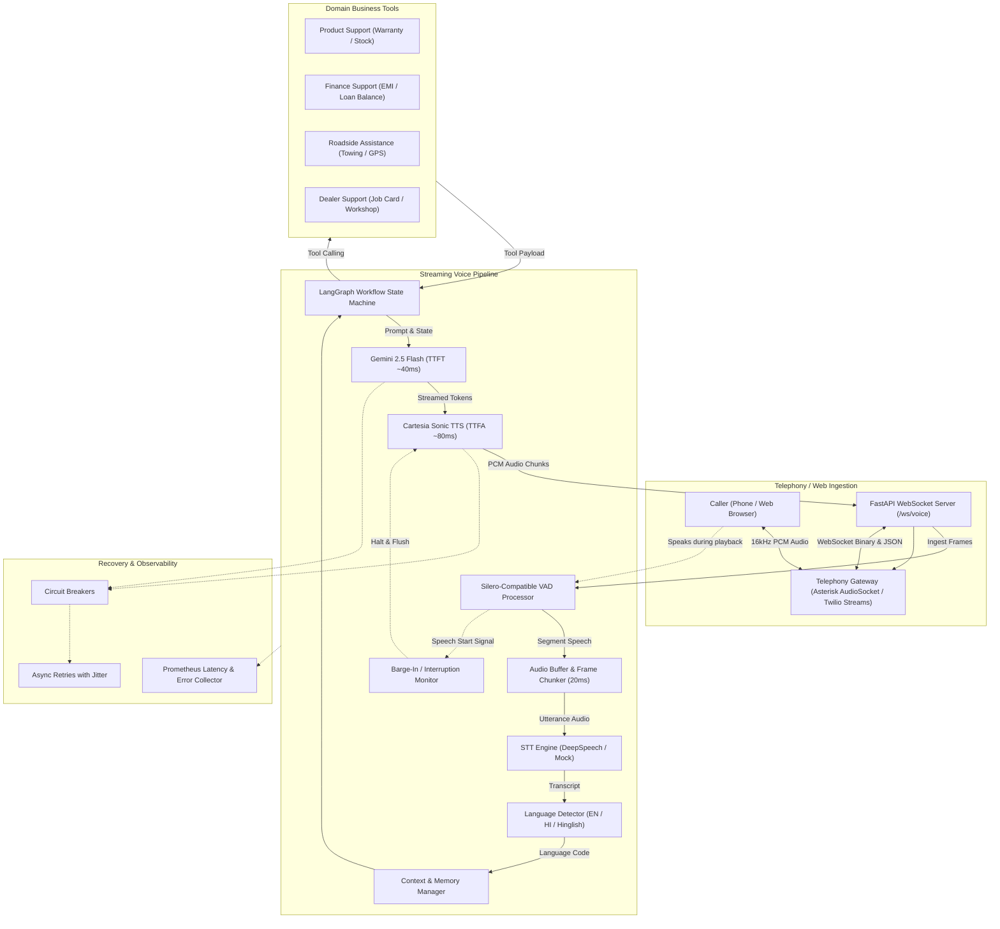

# AI Voice Bot / Conversational AI Platform

[](https://www.python.org/downloads/)
[](https://fastapi.tiangolo.com)
[](https://opensource.org/licenses/MIT)
[]()
[]()

A production-style, real-time Generative AI voice assistant architecture designed for low-latency bidirectional telephony and web conversational AI. Built with **Pipecat** architectural principles, **Gemini 2.5 Flash**, **Cartesia Sonic TTS**, **Silero-compatible VAD**, **LangGraph workflow orchestration**, **FastAPI WebSockets**, and resilient recovery circuits.

---

## Table of Contents
1. [Overview & Problem Statement](#overview--problem-statement)
2. [End-to-End System Architecture](#end-to-end-system-architecture)
3. [Key Capabilities & Features](#key-capabilities--features)
4. [Technology Stack](#technology-stack)
5. [Repository Structure](#repository-structure)
6. [Quickstart & Installation](#quickstart--installation)
7. [Operating Modes](#operating-modes)
   - [Mock Mode (Zero External Credentials)](#mock-mode-zero-external-credentials)
   - [Live Cloud Provider Mode](#live-cloud-provider-mode)
8. [CLI Commands](#cli-commands)
9. [Conversational Support Workflows](#conversational-support-workflows)
10. [Multilingual Switching (EN ↔ HI ↔ Hinglish)](#multilingual-switching-en--hi--hinglish)
11. [Barge-In / Interruption Handling](#barge-in--interruption-handling)
12. [Latency Instrumentation & Benchmarking](#latency-instrumentation--benchmarking)
13. [Failure Recovery & Circuit Breakers](#failure-recovery--circuit-breakers)
14. [WebSocket Streaming Protocol](#websocket-streaming-protocol)
15. [Docker Deployment](#docker-deployment)
16. [Troubleshooting & FAQ](#troubleshooting--faq)
17. [Known Limitations & Roadmap](#known-limitations--roadmap)

---

## Overview & Problem Statement

Traditional Interactive Voice Response (IVR) systems rely on rigid DTMF key-press trees and static phrase matching. Modern Generative AI voice agents demand:
- **Sub-second turn-around latency** (Total turn-around under 300ms–800ms) to feel natural.
- **Natural speech interruption (Barge-in)** so callers can cut in without waiting for the bot to finish.
- **Dynamic code-switching**, allowing callers to fluidly switch between English, Hindi, and colloquial Hinglish mid-dialogue.
- **Stateful business orchestration** for complex customer service queries (warranty lookups, loan calculations, emergency roadside dispatches).
- **Fault-tolerant resilience**, ensuring the call never drops even if upstream cloud APIs experience transient outages.

This platform implements an enterprise-grade solution addressing all of these challenges with modular, cleanly separated components.

---

## End-to-End System Architecture



---

## Key Capabilities & Features

- **Bidirectional Streaming**: 16kHz PCM16 audio chunked into 20ms frames over asynchronous WebSockets.
- **Sub-100ms TTFT & TTFA**: Ultra-fast initial token and audio generation simulating real phone conversations.
- **Silero-Compatible VAD**: Energy and spectral power classification with configurable speech (`250ms`) and silence (`500ms`) boundary gates.
- **Deterministic Mock Mode**: Entire platform runs out-of-the-box locally without requiring paid API keys, GPU hardware, or multi-gigabyte models.
- **Mid-Call Multilingual Switching**: Automatically recognizes and shifts responses between English, Hindi (Devanagari), and Hinglish (Romanized Hindi).
- **Instant Barge-In**: Real-time task cancellation and buffer flushing when caller speaks over bot speech.
- **LangGraph State Graph**: Explicit state transitions: `receive_user_input` ➔ `detect_language` ➔ `context_retrieval` ➔ `classify_intent` ➔ `workflow_router` ➔ `execute_business_tools` ➔ `generate_response` ➔ `prepare_tts`.
- **4 Real Customer Support Workflows**: Product warranty/orders, auto finance/EMI, roadside emergency dispatch, and dealer job card status.
- **Circuit Breaker Resiliency**: Prevents cascading failures with automatic fallbacks and exponential backoff retry.
- **Observability**: Statistical percentile latency metrics (min, mean, median, p95, max) saved to JSON/CSV reports.

---

## Technology Stack

| Layer | Technology |
|---|---|
| **Runtime & Framework** | Python 3.10+, FastAPI, Uvicorn, Asyncio |
| **Pipeline Architecture** | Pipecat-oriented streaming modular design |
| **Generative LLM** | Google Gemini 2.5 Flash / Vertex AI (`gemini-2.5-flash`) |
| **Text-To-Speech (TTS)** | Cartesia Sonic Multilingual (`sonic-multilingual`) |
| **Speech-To-Text (STT)** | Mozilla DeepSpeech / Mock STT engine |
| **Voice Activity Detection** | Silero VAD energy/spectral classification logic |
| **Workflow State Machine** | LangGraph (`StateGraph`), Pydantic v2 |
| **Audio Processing** | NumPy, SoundFile, SciPy |
| **Observability** | Structlog, Prometheus-compatible MetricsCollector |
| **Testing & Deployment** | Pytest, Pytest-Asyncio, Docker, Docker Compose |

---

## Repository Structure

```
ai-voice-bot/
├── main.py                     # Unified CLI & FastAPI application entrypoint
├── README.md                   # Complete architectural and operational manual
├── LICENSE                     # MIT Open Source License
├── requirements.txt            # Production Python package dependencies
├── pyproject.toml              # Build specifications, tool configs & pytest setup
├── Dockerfile                  # Production container definition
├── docker-compose.yml          # Container orchestration manifest
├── .env.example                # Template configuration parameters
│
├── config/                     # Application configuration
│   ├── __init__.py
│   └── settings.py             # Pydantic BaseSettings environment loader
│
├── app/
│   ├── api/                    # HTTP & WebSocket endpoints
│   │   ├── routes.py           # Consolidated API routers
│   │   ├── websocket.py        # Real-time voice streaming endpoint (/ws/voice)
│   │   └── health.py           # /health, /ready, /metrics endpoints
│   ├── pipeline/               # Core Pipecat streaming audio pipeline
│   │   ├── voice_pipeline.py   # Orchestrator connecting VAD, STT, LLM, TTS
│   │   ├── pipeline_factory.py # Pipeline instantiation factory
│   │   ├── audio_transport.py  # WebSocket & In-Memory audio transports
│   │   ├── vad_processor.py    # Voice activity detection processor
│   │   ├── stt_processor.py    # STT transcription with timeouts & retries
│   │   ├── llm_processor.py    # LLM generation with LangGraph orchestration
│   │   ├── tts_processor.py    # TTS audio streaming with cancellation
│   │   └── interruption_handler.py # Barge-in detector and cancellation manager
│   ├── providers/              # Modular speech & AI providers
│   │   ├── stt/                # DeepSpeech & Mock STT
│   │   ├── llm/                # Gemini 2.5 Flash & Mock LLM
│   │   └── tts/                # Cartesia Sonic & Mock TTS
│   ├── conversation/           # Conversational memory & LangGraph
│   │   ├── state.py            # ConversationState data models
│   │   ├── graph.py            # LangGraph StateGraph state machine
│   │   ├── context_manager.py  # Context windowing & transcript exporter
│   │   ├── intent_router.py    # Customer support intent classification
│   │   ├── language_detector.py# English / Hindi / Hinglish detector
│   │   └── prompt_manager.py   # Localized system prompt templates
│   ├── workflows/              # Business domain workflow managers
│   │   ├── base_workflow.py    # Base workflow interface
│   │   ├── product_support.py  # Warranty, inventory, specifications
│   │   ├── finance_support.py  # EMI calculation, loan balance
│   │   ├── roadside_assistance.py # Breakdown dispatch, towing
│   │   └── dealer_support.py   # Workshop status, job card tracking
│   ├── tools/                  # Deterministic domain business tools
│   │   ├── product_tools.py
│   │   ├── finance_tools.py
│   │   ├── roadside_tools.py
│   │   └── dealer_tools.py
│   ├── audio/                  # Audio manipulation utilities
│   │   ├── audio_utils.py      # Format conversions (PCM16, float32, WAV)
│   │   ├── chunking.py         # 20ms audio frame chunker
│   │   ├── resampling.py       # Audio resamplers
│   │   └── audio_buffer.py     # Thread-safe ring buffer
│   ├── recovery/               # Resiliency circuits
│   │   ├── circuit_breaker.py  # Three-state circuit breaker
│   │   ├── retry.py            # Asynchronous exponential backoff with jitter
│   │   └── fallback.py         # Multilingual graceful fallback responses
│   ├── observability/          # Monitoring & metrics
│   │   ├── latency.py          # LatencyTracker milestone recorder
│   │   ├── metrics.py          # Prometheus-compatible metrics aggregator
│   │   ├── logger.py           # Structured logging (JSON format)
│   │   └── tracing.py          # Distributed session tracing
│   └── schemas/                # Pydantic v2 data transfer schemas
│       ├── audio.py
│       ├── conversation.py
│       ├── requests.py
│       └── responses.py
│
├── scripts/                    # Utilities and standalone entrypoints
│   ├── run_voice_bot.py        # Standalone server starter
│   ├── run_websocket_client.py # Audio streaming test client
│   ├── test_pipeline.py        # End-to-end direct pipeline test
│   ├── benchmark_latency.py    # Statistical latency benchmark script
│   └── generate_demo_audio.py  # Synthetic speech & silence WAV generator
│
├── tests/                      # Automated Pytest test suite (38 tests)
│   ├── test_vad.py
│   ├── test_stt.py
│   ├── test_llm.py
│   ├── test_tts.py
│   ├── test_language_detection.py
│   ├── test_barge_in.py
│   ├── test_workflows.py
│   ├── test_recovery.py
│   └── test_latency.py
│
├── docs/                       # Comprehensive architectural & operational manuals
│   ├── architecture.md         # In-depth system architecture
│   ├── pipeline.md             # 15-stage pipeline lifecycle
│   ├── deployment.md           # Docker, Telephony & Production deployment
│   ├── troubleshooting.md      # Diagnostics and issue remediation
│   └── api.md                  # REST & WebSocket protocol reference
│
├── data/                       # Test datasets and synthetic audio
│   ├── audio/                  # Demo speech & silence WAVs
│   ├── demo/                   # Multi-turn conversational JSON scenarios
│   └── conversations/          # Saved call logs
│
├── outputs/                    # Output directories
│   ├── audio/                  # Recorded call audio
│   ├── transcripts/            # Exported JSON conversation logs
│   ├── metrics/                # Latency benchmark CSV and JSON outputs
│   └── reports/                # Performance reports
└── logs/                       # Application execution log files
```

---

## Quickstart & Installation

### 1. Clone & Set Up Environment
```bash
git clone https://github.com/example/ai-voice-bot.git
cd ai-voice-bot

python -m venv venv
# On Windows:
.\venv\Scripts\activate
# On Linux/macOS:
source venv/bin/activate

pip install -r requirements.txt
```

### 2. Verify Installation
```bash
python main.py health
```

---

## Operating Modes

### Mock Mode (Zero External Credentials)
By default, the platform runs in **Mock Mode**, enabling 100% of pipeline functions without requiring external cloud accounts or credit cards:
```bash
# In .env (or left as defaults)
ENABLE_MOCK_STT=True
ENABLE_MOCK_LLM=True
ENABLE_MOCK_TTS=True
```
- STT synthesizes realistic text based on audio timing.
- LLM routes intelligently through local domain workflows.
- TTS synthesizes valid 16kHz PCM16 audio waveforms with realistic TTFA.

### Live Cloud Provider Mode
To connect to live production cloud providers, edit your `.env` file:
```ini
ENABLE_MOCK_STT=False
ENABLE_MOCK_LLM=False
ENABLE_MOCK_TTS=False

# Google Gemini / Vertex AI
GEMINI_API_KEY="your-gemini-api-key"
GEMINI_MODEL="gemini-2.5-flash"

# Cartesia Sonic TTS
CARTESIA_API_KEY="your-cartesia-api-key"
CARTESIA_VOICE_ID="a0e99841-438c-4a64-b679-ae501e7d6091"
CARTESIA_MODEL="sonic-multilingual"

# DeepSpeech STT
DEEPSPEECH_MODEL_PATH="path/to/deepspeech-0.9.3-models.pbmm"
DEEPSPEECH_SCORER_PATH="path/to/deepspeech-0.9.3-models.scorer"
```

---

## CLI Commands

The unified `main.py` entrypoint provides commands for all platform operations:

```bash
# Display help and available commands
python main.py --help

# 1. Run local multi-turn conversational demo (with language switching & tools)
python main.py demo

# 2. Run latency benchmark (calculates statistical percentiles)
python main.py benchmark --runs 10

# 3. Run automated pytest test suite
python main.py test

# 4. Check system health and provider readiness
python main.py health

# 5. Start the FastAPI WebSocket streaming server
python main.py server --host 0.0.0.0 --port 8000
```

---

## Conversational Support Workflows

The platform includes four realistic customer support domains implemented with LangGraph and dedicated business tools:

| Workflow | Example Inquiries | Tools Executed | Typical Response |
|---|---|---|---|
| **Product Support** | *"Check warranty for SN-5521"*, *"Is console in stock?"* | `get_product_warranty`, `get_product_availability` | Active warranty confirmation through 2027 with manufacturer coverage. |
| **Finance Support** | *"What is my EMI balance for ACC-101?"* | `get_emi_details`, `get_loan_balance` | Installment amount (₹24,500), due date, and auto-debit status. |
| **Roadside Assistance** | *"My car broke down on Highway 48 with a flat tire"* | `dispatch_roadside_assistance` | Emergency rescue patrol dispatched with live ETA (22 mins). |
| **Dealer Support** | *"What is the status of job card JC-7711?"* | `get_dealer_status` | Current repair stage (Quality Inspection) and delivery time. |

---

## Multilingual Switching (EN ↔ HI ↔ Hinglish)

Callers can seamlessly switch languages mid-conversation. The `LanguageDetector` handles three distinct representations:

1. **English (`en`)**:
   > *"Can you please check the warranty for my car's infotainment system?"*
2. **Hindi Devanagari (`hi`)**:
   > *"मेरी गाड़ी का ईएमआई स्टेटस क्या है?"*
   > *Bot replies in fluent Devanagari Hindi.*
3. **Colloquial Hinglish (`hinglish`)**:
   > *"Achha please Hindi mein batao meri warranty kab tak valid hai?"*
   > *Bot dynamically detects the switch directive and replies in Romanized or Devanagari Hindi.*

---

## Barge-In / Interruption Handling

Natural voice conversations require immediate interruption handling:

```
[Bot is actively streaming audio response...]
Caller begins speaking: "Wait, stop—what is my balance?"
   │
   ├─► Silero VAD detects speech energy (threshold >= 0.5)
   ├─► InterruptionHandler triggers:
   │     1. Immediately halts ongoing asyncio TTS synthesis task
   │     2. Flushes WebSocket outbound audio buffer
   │     3. Transmits {"event": "barge_in"} control signal to caller
   └─► STT begins transcribing new user utterance immediately
```

---

## Latency Instrumentation & Benchmarking

The platform instruments every turn with microsecond-precision timestamps:

| Metric | Description | Target |
|---|---|---|
| **STT Latency** | Audio buffer ingestion to final transcript | < 100ms |
| **LLM TTFT** | Prompt dispatch to first generated token | < 50ms |
| **LLM Total** | Complete text generation duration | < 500ms |
| **TTS TTFA** | First tokens to first playable audio chunk | < 100ms |
| **End-to-End (E2E)** | Caller silence to first assistant audio frame | **< 150ms (Mock) / < 600ms (Live)** |

### Run Benchmark
```bash
python main.py benchmark --runs 20
```

Results are automatically saved to `outputs/metrics/latency_report.json` and `latency_report.csv`.

---

## Failure Recovery & Circuit Breakers

To guarantee uninterrupted service in enterprise contact centers:

1. **Async Retries with Jitter**: Transient network hiccups retry automatically up to 2 times using randomized exponential backoff.
2. **Circuit Breaker (`CircuitBreaker`)**:
   - `CLOSED`: Normal operation.
   - `OPEN`: If upstream providers fail 3 times consecutively, the circuit opens, failing fast to fallback mock handlers to prevent connection pool exhaustion.
   - `HALF_OPEN`: After a 20-second cooldown, probes with a trial request to verify upstream recovery.
3. **Graceful Fallbacks (`get_fallback_response`)**: Localized conversational messages inform the caller of minor delays without terminating the call.

---

## WebSocket Streaming Protocol

### Connection
- **Endpoint**: `ws://localhost:8000/ws/voice`
- Multiplexes raw binary audio chunks (PCM16 16kHz) and JSON control events.

### Client Example (Python)
```python
import asyncio
import websockets
import json

async def talk_to_bot():
    uri = "ws://127.0.0.1:8000/ws/voice"
    async with websockets.connect(uri) as ws:
        # Start session
        await ws.send(json.dumps({
            "type": "session_start",
            "payload": {"caller_id": "client_alex", "initial_language": "en"}
        }))

        # Send text utterance
        await ws.send(json.dumps({
            "type": "text_input",
            "payload": {"text": "What is the warranty status for SN-5521?"}
        }))

        # Receive streamed audio and events
        async for msg in ws:
            if isinstance(msg, bytes):
                print(f"Received {len(msg)} bytes of synthesized PCM audio")
            else:
                print(f"Server event: {msg}")

asyncio.run(talk_to_bot())
```

---

## Docker Deployment

### Run with Docker Compose
```bash
docker compose up -d
```

### Verify Container Health
```bash
curl http://localhost:8000/health
curl http://localhost:8000/ready
curl http://localhost:8000/metrics
```

---

## Troubleshooting & FAQ

See [`docs/troubleshooting.md`](docs/troubleshooting.md) for solutions to:
- Audio stutter and packet jitter
- Echo cancellation and barge-in sensitivity tuning
- Provider rate limits and circuit breaker resets
- Session trace correlation

---

## Known Limitations & Roadmap

- **Mock Mode Audio**: Synthetic PCM waveforms are pure sine tones modulated by vocal formant envelopes; deploy Cartesia or ElevenLabs for production vocal realism.
- **DeepSpeech Acoustic Models**: DeepSpeech requires pre-downloaded English acoustic graphs; for multi-accent production, hosted Google Speech-to-Text or Whisper API is recommended.
- **Telephony Signaling**: SIP/RTP termination is handled via telephony gateways (Asterisk/Twilio) and forwarded to this service over WebSockets.

---

## License

This project is licensed under the MIT License — see the [LICENSE](LICENSE) file for details.
