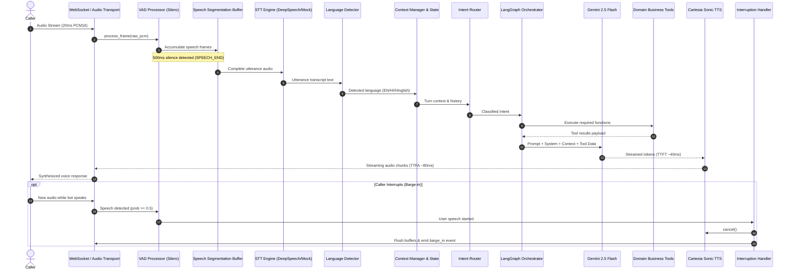

# Conversational Voice Pipeline — Detailed Lifecycle & Execution Flow

This document details the 15 discrete processing stages of each conversational turn in the AI Voice Bot platform.

---

## 15-Stage Pipeline Lifecycle

---

### Step 1: Audio Ingestion
- **Input**: Continuous PCM16 byte stream sent by client via WebSocket binary frames.
- **Validation**: Incoming chunks are validated by `validate_pcm_chunk`:
  - Enforces 2-byte sample alignment (length % 2 == 0).
  - Maximum chunk size safety boundary (64KB default).
  - Normalization to single channel mono at 16,000 Hz.

### Step 2: Voice Activity Detection (VAD)
- **Module**: `VADProcessor` (`app/pipeline/vad_processor.py`).
- **Algorithm**: RMS energy calculation and spectral distribution mapping normalized across [0.0, 1.0].
- **Thresholding**: Frames exceeding `vad_threshold` (0.5) trigger speech state accumulation.

### Step 3: Speech Segmentation & Buffer Management
- Audio frames during active speech are queued into an in-memory byte buffer.
- When continuous silence exceeds `vad_min_silence_duration` (500ms), a `SPEECH_END` event fires.
- The complete buffered speech segment is packaged into a contiguous PCM audio slice and handed to the STT processor.

### Step 4: Speech-to-Text (STT)
- **Module**: `STTProcessor` (`app/pipeline/stt_processor.py`).
- Wrapped with `LatencyTracker` to record `stt_started` and `stt_completed`.
- Invokes provider asynchronously under strict timeout bounds (`stt_timeout_seconds: 3.0s`).
- Emits `transcript_final` event over WebSocket for real-time client side-car display.

### Step 5: Language Detection & Dynamic Code-Switching
- **Module**: `LanguageDetector` (`app/conversation/language_detector.py`).
- Inspects utterance text:
  1. Detects explicit mid-call commands (e.g. *"Hindi mein bataiye"*, *"Switch to English"*).
  2. Inspects Unicode points for Devanagari script (`\u0900-\u097F`).
  3. Matches phonetic Romanized Hindi dictionaries for Hinglish.
- Updates session state language (`LanguageCode.EN`, `LanguageCode.HI`, `LanguageCode.HINGLISH`).

### Step 6: Conversation State & Context Memory
- **Module**: `ContextManager` (`app/conversation/context_manager.py`).
- Tracks multi-turn dialogue history, user questions, assistant answers, active session status, and caller metadata.
- Prepares rolling context window preventing context overflow while preserving essential entities (e.g. account numbers, serial codes).

### Step 7: Intent Routing
- **Module**: `IntentRouter` (`app/conversation/intent_router.py`).
- Classifies user goal into one of 4 business domains:
  - `PRODUCT_SUPPORT`
  - `FINANCE_SUPPORT`
  - `ROADSIDE_ASSISTANCE`
  - `DEALER_SUPPORT`
  - Fallback / General inquiry.

### Step 8: LangGraph Workflow Orchestration
- **Module**: `ConversationWorkflowGraph` (`app/conversation/graph.py`).
- Executes a state machine graph across sequential and conditional nodes:
  - `receive_user_input` ➔ `detect_language` ➔ `context_retrieval` ➔ `classify_intent` ➔ `workflow_router` ➔ `execute_business_tools` ➔ `generate_response` ➔ `prepare_tts`.

### Step 9: Tool Execution
- **Modules**: `app/tools/*.py`.
- Dispatches tool calls according to workflow requirements:
  - `get_product_warranty(serial_number)`
  - `get_emi_details(account_number)`
  - `dispatch_roadside_assistance(location, issue_type)`
  - `get_dealer_status(job_card_id)`
- Tool outputs are formatted as structured `ToolResult` schemas.

### Step 10: Gemini 2.5 Flash Response Generation
- **Module**: `GeminiProvider` (`app/providers/llm/gemini_provider.py`).
- System prompts configure persona, empathy, brevity (max 2 sentences for natural voice flow), and target language.
- Generates streaming tokens with sub-50ms TTFT.

### Step 11: Text-to-Speech (TTS) Synthesis
- **Module**: `TTSProcessor` / `CartesiaTTSProvider`.
- Streams text tokens as phrases; synthesizes audio chunks on sentence boundaries or punctuation marks.
- Yields PCM16 audio buffers ready for immediate playback.

### Step 12: Streaming Audio Output
- **Module**: `WebSocketAudioTransport` (`app/pipeline/audio_transport.py`).
- Dispatches raw PCM16 audio buffers back to caller over WebSocket binary frames.
- Sends interleaved JSON control events (`llm_token`, `tts_complete`, `latency_breakdown`).

### Step 13: Barge-In (Interruption Handling)
- If the caller speaks while the assistant is streaming synthesized speech, `InterruptionHandler` immediately:
  1. Cancels the active TTS synthesis task.
  2. Clears pending audio buffers in transport.
  3. Sends a `barge_in` server event to tell the client to halt audio playback.

### Step 14: Failure Recovery & Circuit Breakers
- **Modules**: `app/recovery/*.py`.
- **Async Retry**: Transient network glitches retry up to 2 times with exponential backoff and randomized jitter.
- **Circuit Breaker**: If external APIs fail 3 times consecutively, trips OPEN to prevent thread starvation and falls back to deterministic local mock handlers.
- **Fallback Generator**: Multilingual canned responses explain network delays naturally without dropping the call.

### Step 15: Session Completion & Post-Call Processing
- When the caller hangs up or sends `session_end`:
  1. Complete conversation transcript is serialized to `outputs/transcripts/<session_id>.json`.
  2. End-to-end latency metrics are recorded into `outputs/metrics/`.
  3. Total session counters and performance metrics are updated in `MetricsCollector`.
  4. Audio transports and background task handles are cleanly closed.
